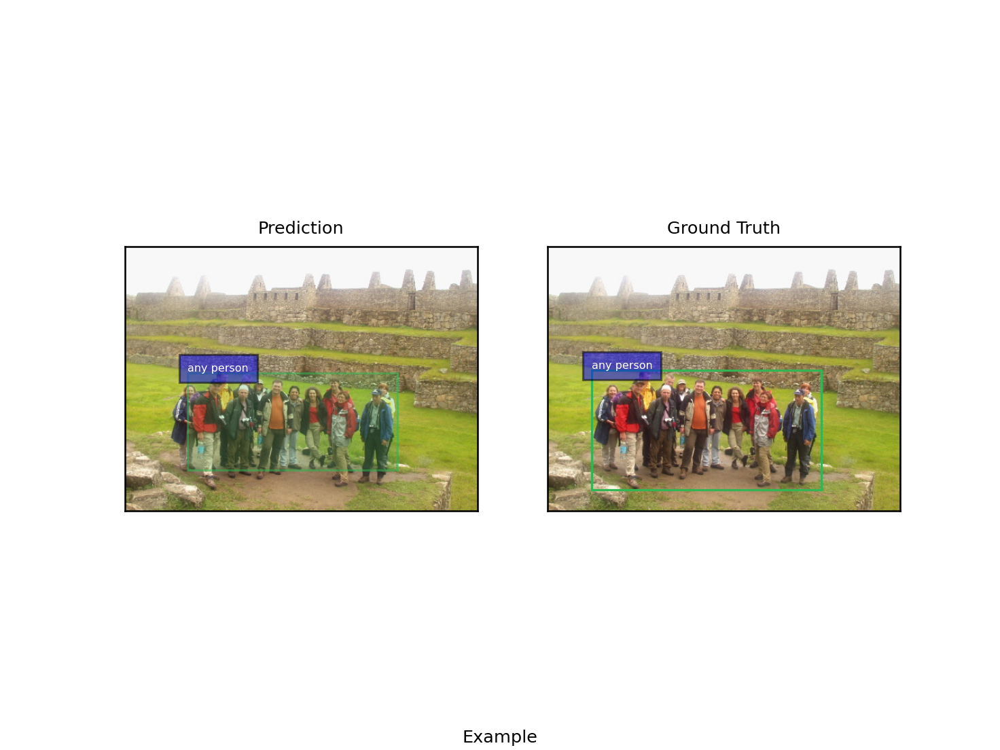

# Log

<!-- START doctoc generated TOC please keep comment here to allow auto update -->
<!-- DON'T EDIT THIS SECTION, INSTEAD RE-RUN doctoc TO UPDATE -->
<details>
<summary>Table of Contents</summary>

- [31/08/2021 - Classe `__background__`](#31082021---classe-__background__)
- [30/08/2021 - Studio frequenza classi e altri esperimenti](#30082021---studio-frequenza-classi-e-altri-esperimenti)
- [27/08/2021 - Classes frequency](#27082021---classes-frequency)
- [23/08/2021 - Slide aggiornamenti e dati raccolti](#23082021---slide-aggiornamenti-e-dati-raccolti)
- [20/08/2021 - Loss + approfondimenti](#20082021---loss--approfondimenti)
- [18/08/2021 - Call post Ferragosto](#18082021---call-post-ferragosto)
- [15/08/2021 - Analisi impatto del numero di bounding box](#15082021---analisi-impatto-del-numero-di-bounding-box)
- [13/08/2021 (x) - Accuracy sul training/valid crescente!](#13082021-x---accuracy-sul-trainingvalid-crescente)
- [10/08/2021 - Altri problemi evidenziati da Davide](#10082021---altri-problemi-evidenziati-da-davide)
- [06/08/2021 - Sviluppo parallelo di una codebase nuova](#06082021---sviluppo-parallelo-di-una-codebase-nuova)
- [05/08/2021 - Validazione del modello: ricerca e codice](#05082021---validazione-del-modello-ricerca-e-codice)
- [04/08/2021 - Problema della validazione del modello: matching chunk-query](#04082021---problema-della-validazione-del-modello-matching-chunk-query)
- [03/08/2021 (x) - Riunione per aggiornamenti](#03082021-x---riunione-per-aggiornamenti)
- [23/07/2021 - Branch per i training e esecuzione sul cluster (CPU)](#23072021---branch-per-i-training-e-esecuzione-sul-cluster-cpu)
- [22/07/2021 - Fix problemi evidenziati nella call](#22072021---fix-problemi-evidenziati-nella-call)
- [21/07/2021 (x) - Review del codice con Davide](#21072021-x---review-del-codice-con-davide)
- [20/07/2021 - Problema bb attive fixed e padding bb](#20072021---problema-bb-attive-fixed-e-padding-bb)
- [19/07/2021 - Altri problemi di maschere sulla loss](#19072021---altri-problemi-di-maschere-sulla-loss)
- [18/07/2021 - Problemi di maschere sulle loss?](#18072021---problemi-di-maschere-sulle-loss)
- [16/07/2021 (x) - Stop ssh torre, fix `get_iou_score` loss](#16072021-x---stop-ssh-torre-fix-get_iou_score-loss)
- [14-15/07/2021 - Run dei modelli e8, e9, e10](#14-15072021---run-dei-modelli-e8-e9-e10)
- [13/07/2021 - Problemi di training](#13072021---problemi-di-training)
- [12/07/2021 - Modifica top-k loss e IndexError](#12072021---modifica-top-k-loss-e-indexerror)
- [09/07/2021 - Studio per utilizzo sentence nel modello](#09072021---studio-per-utilizzo-sentence-nel-modello)
- [08/07/2021 - Minor refactor and problem fixes](#08072021---minor-refactor-and-problem-fixes)
- [06/07/2021 - Similarity based attraction](#06072021---similarity-based-attraction)
- [05/07/2021 - Top-K repulsion loss](#05072021---top-k-repulsion-loss)
- [02/07/2021 - Test Loss e Masking](#02072021---test-loss-e-masking)
- [01/07/2021 - Implementazione loss](#01072021---implementazione-loss)
- [29/06/2021 - Call con Davide per problemi sulle loss](#29062021---call-con-davide-per-problemi-sulle-loss)
- [28/06/2021 - Risoluzione problemi referit / ottimizzazione loss](#28062021---risoluzione-problemi-referit--ottimizzazione-loss)
- [22/06/2021 - Inizio adattamento per referit](#22062021---inizio-adattamento-per-referit)
- [21/06/2021 (x) - Call per aggiornamento con il prof.](#21062021-x---call-per-aggiornamento-con-il-prof)
- [18/06/2021 - Test Example Procedure](#18062021---test-example-procedure)
- [17/06/2021 - Learning Unsupervised Visual Grounding Through Semantic Self-Supervision](#17062021---learning-unsupervised-visual-grounding-through-semantic-self-supervision)
- [16/06/2021 - Accuracy e Pointing Game Accuracy](#16062021---accuracy-e-pointing-game-accuracy)
- [15/06/2021 - Loss: IoU e accuracy](#15062021---loss-iou-e-accuracy)
- [11/06/2021 - Black friday: problema di memoria / problema chunk vuoti](#11062021---black-friday-problema-di-memoria--problema-chunk-vuoti)
- [10/06/2021 - Input negativi e loss discriminativa](#10062021---input-negativi-e-loss-discriminativa)
- [09/06/2021 - Modifica funzioni di padding e loss, flickr30k pico, github action](#09062021---modifica-funzioni-di-padding-e-loss-flickr30k-pico-github-action)
- [08/06/2021 - Modifica dataloader e funzioni di padding](#08062021---modifica-dataloader-e-funzioni-di-padding)
- [07/06/2021 - Progettazione modello Weakly-Supervised](#07062021---progettazione-modello-weakly-supervised)
- [04/06/2021 (x) - Discussione sul lavoro da fare sul codice](#04062021-x---discussione-sul-lavoro-da-fare-sul-codice)
- [03/06/2021](#03062021)
- [01/06/2021](#01062021)
- [31/05/2021](#31052021)
- [28/05/2021](#28052021)
- [26/05/2021 - 27/05/2021](#26052021---27052021)
- [25/05/2021](#25052021)
- [24/05/2021](#24052021)
- [22/05/2021](#22052021)
- [21/05/2021](#21052021)
- [20/05/2021](#20052021)
- [19/05/2021](#19052021)
- [18/05/2021](#18052021)
- [17/05/2021](#17052021)
- [13/05/2021 (\*)](#13052021-%5C)
- [11/05/2021](#11052021)
- [04/05/2021 - 05/05/2021](#04052021---05052021)
- [27/04/2021 - 03/05/2021](#27042021---03052021)
- [26/04/2021](#26042021)
- [22/04/2021 (\*)](#22042021-%5C)
- [21/04/2021](#21042021)
- [20/04/2021](#20042021)
- [19/04/2021](#19042021)
- [30/04/2021 (\*)](#30042021-%5C)

</details>
<!-- END doctoc generated TOC please keep comment here to allow auto update -->

# 06/09/2021 - Implementazione similarità classi

Implementata la similarità tra classi delle bounding box e frase.

# 03/09/2021 - Introduzione delle classi

**Roadmap**

- ottenere l'embedding delle classi (eventualmente, processare quelle out of
  vocabulary - per ora rimpiazziamo la rappresentazione un vettore inizializzato
  a random)

- calcolare la similarità tra la classe e la query (relativi embedding)

- aggiustare le varie dimensioni e pesare gli score

La parte critica è il calcolo di un embedding significativo dalla query:
inizialmente possiamo provare la media di tutte le parole, ma la cosa migliore
sarebbe trovare "l'head" della query con un parser e usare il suo embedding.

**Analisi sulle classi**

Ci sono 295 classi out-of-vocabulary.

Nel dataset (training) ci sono 8315 bounding box ground truth etichettate con
classi out-of-vocabulary.\
Il modello predice 8445 bounding box etichettate con classi out-of-vocabulary.\
La differenza del valore assoluto tra la frequenza delle classi predette e
quella delle ground truth è 2948 su un totale di 427226 query

<details>
<summary>Classi out-of-vocabulary</summary>

```
alarm clock, ceiling fan, tail fin, birthday cake, stop sign,stopsign,
microwave,microwave oven, skateboard ramp, refrigerator,fridge, knee pads,
tennis court, tea pot, television,tv, garage door, sailboat,sail boat,
racket,racquet, rock wall, headboard,head board, tea kettle, tennis
racket,tennis racquet, train station, tennis player, toilet brush, pepper
shaker, hair dryer, toilet seat, skateboard,skate board, floor lamp, french
fries, christmas tree, living room, teddy bear, baseball field, ski boot, shower
curtain, polar bear, hot dog,hotdog, surfboard,surf board, dirt bike, tail wing,
area rug, bow tie, fire extinguisher, tail feathers, beach chair, fire
hydrant,hydrant, weather vane, soccer ball, head band, bath tub, coffee table,
traffic light, parking meter, wet suit, teddy bears, suitcase,suit case, tank
top, shin guard, wii remote, pizza slice, home plate, ski boots, snow suit,
banana slice, stuffed animals, train platform, tissue box, cutting board,
license plate, ski pole, clock tower, toilet tank, palm trees, skate park,
computer monitor, flip flop, remote control, paper towels, train tracks,
donut,doughnut, soccer player, toilet bowl, lounge chair, sidewalk,side walk,
stove top,stovetop, tomato slice, window sill, toilet lid, "pitchers mound",
palm tree, banana bunch, tennis shoe, giraffe head, baseball player, water
bottle, tennis ball, cell phone, computer mouse, ski pants, clock face, fire
escape, police officer, trash can, front window, office chair, door knob, banana
peel, baseball game, cabinet door, traffic cone, nightstand,night stand, suit
jacket, train engine, wrist band, toilet paper, street sign, computer screen,
wine glass, train car, donuts,doughnuts, tennis match, railroad tracks, stuffed
bear, snow pants, neck tie, baseball bat, safety cone, paper towel, back wheel,
soccer field, throw pillow, oven door, lamp shade, pine tree, lamp
post,lamppost, station wagon, signal light, american flag, baseball cap, front
legs, life jacket, water tank, gas station, entertainment center, stuffed
animal, display case, front wheel, coffee pot, cowboy hat, table cloth, fire
truck,firetruck, game controller, sweat band, coin slot, pillow case, coffee
cup, counter top, baseball uniform, book shelf, facial hair, end table, shin
guards, head light, tennis net, trash bag, ski poles, parking lot, gas tank,
soap dispenser, life vest, train front, exhaust pipe, light fixture, power
lines, roman numerals, picnic table, wine bottle, tree trunk, motor bike,
traffic sign, little girl, passenger car, brake light, roman numeral, shower
head, handle bars, cardboard box, mountain range, eye glasses, salt shaker, knee
pad, shower door, bathing suit, manhole cover, door handle, picture frame, hour
hand, dvd player, ski slope, french fry, landing gear, coffee maker, light
switch, tv stand, air vent, steering wheel, baseball glove, power pole, dirt
road, telephone pole, jet engine, tee shirt, face mask, bathroom sink, laptop
computer, windshield wipers, hill side, tail light,taillight, snow board, stop
light, ball cap, traffic signal, soda can, ski lift, tennis shoes, swim trunks,
butter knife, train cars, pine trees, park bench, second floor, hand towel, flip
flops, back pack, ski tracks, baseball players, stone wall, dress shirt, ski
goggles, power line, train track, air conditioner, baseball mitt, mouse pad,
garbage can, taxi cab, control panel, clock hand, brick wall, grass field,
utility pole, mountain top, hot dogs,hotdogs, bed frame, tail lights, traffic
lights, candle holder, guard rail, tree branches, trash bin, side mirror, light
pole, street lamp, paper plate, fence post, door frame, tshirt,t-shirt,t shirt,
wire fence, side window, table lamp, pony tail, ocean water, flower pot, tree
line, sign post, ski suit, passenger train, "catchers mitt", electrical outlet,
bike rack, windshield wiper, bus stop, police car, name tag, computer keyboard,
glass door, wine glasses, young man, light post, ski jacket, streetlight,street
light, beer bottle, wrist watch, tile floor, tree branch, towel rack
```

</details>

# 02/09/2021 (x) - Call con i prof

- Provare a sostituire LSTM con FFNN

- Problema principale: allineamento tra le due modalità (testo e immagini),
  bisogna sicuramente utilizzare informazione aggiuntiva

- Utilizzare le classi come negli altri paper per calcolare un peso e scalare le
  similarità

# 01/09/2021 - Problema analisi frequenze

Analisi delle frequenze deve comparare le freq delle classi con 100 bb e le freq
delle classi senza background. Precedentemente, quest'ultimo era stato
implementato facendo in modo di ricavare la classe delle gt e poi rimuovere
background.

Rigenerati i grafici di analisi e completate le slide per la riunione del
02/09/2021.

# 31/08/2021 - Classe `__background__`

**Upperbound accuracy togliendo le bounding box etichettate con classe
`__background__`**

_Flickr30k_

```
INFO:root:data_dir=/home/lparolar/Projects/weakvtg/data/flickr30k_raw/preprocessed, remove_background_boxes=True
INFO:root:total_match=[245865, 335812, 368660, 382224, 389094, 393617, 396717, 399087, 401087, 402575]
INFO:root:total_examples=[456140, 456140, 456140, 456140, 456140, 456140, 456140, 456140, 456140, 456140]
INFO:root:total_backgrounds=[3953, 68601, 213937, 391291, 576492, 763107, 950855, 1138431, 1325879, 1512887]
INFO:root:accuracy=[53.9012145393958, 73.6203797079844, 80.82167755513659, 83.79532599640461, 85.30144253957118, 86.29302407155699, 86.97263997895382, 87.49221730170562, 87.93067917744553, 88.25689481299601]

Progress: [--->                ] 23 % (7627)
Skipping 2652311904_img.pickle, found 0 caption files.
Progress: [---------->         ] 55 % (17655)
Skipping 3923857105_img.pickle, found 0 caption files.
Progress: [------------->      ] 74 % (23534)
Skipping 4797050581_img.pickle, found 0 caption files.
Progress: [------------------> ] 99 % (31782)
Scanned 31783 images for a total of ca queries.
With 10 bounding box the upperbound accuracy is 53.901215 %, on average we removed 1.243747 % background boxes.
With 20 bounding box the upperbound accuracy is 73.620380 %, on average we removed 10.792090 % background boxes.
With 30 bounding box the upperbound accuracy is 80.821678 %, on average we removed 22.437257 % background boxes.
With 40 bounding box the upperbound accuracy is 83.795326 %, on average we removed 30.778325 % background boxes.
With 50 bounding box the upperbound accuracy is 85.301443 %, on average we removed 36.276752 % background boxes.
With 60 bounding box the upperbound accuracy is 86.293024 %, on average we removed 40.016518 % background boxes.
With 70 bounding box the upperbound accuracy is 86.972640 %, on average we removed 42.738706 % background boxes.
With 80 bounding box the upperbound accuracy is 87.492217 %, on average we removed 44.773582 % background boxes.
With 90 bounding box the upperbound accuracy is 87.930679 %, on average we removed 46.351788 % background boxes.
With 100 bounding box the upperbound accuracy is 88.256895 %, on average we removed 47.600510 % background boxes.

```

_ReferIt_

```
INFO:root:data_dir=/home/lparolar/Projects/weakvtg/data/referit_raw/preprocessed, remove_background_boxes=True
INFO:root:total_match=[66238, 89916, 99121, 102680, 104408, 105556, 106403, 107116, 107707, 108193]
INFO:root:total_examples=[130355, 130355, 130355, 130355, 130355, 130355, 130355, 130355, 130355, 130355]
INFO:root:total_backgrounds=[7602, 60068, 158424, 276134, 399607, 524615, 649710, 774619, 898456, 1021602]
INFO:root:accuracy=[50.81354761996087, 68.9777914157493, 76.03927735798396, 78.76951401940853, 80.09512485136742, 80.97579686241417, 81.6255609681255, 82.17252886348817, 82.62590617927967, 82.99873422576809]

Scanned 19995 images for a total of 130355 queries.
With 10 bounding box the upperbound accuracy is 50.813548 %, on average we removed 3.801950 % background boxes.
With 20 bounding box the upperbound accuracy is 68.977791 %, on average we removed 15.020755 % background boxes.
With 30 bounding box the upperbound accuracy is 76.039277 %, on average we removed 26.410603 % background boxes.
With 40 bounding box the upperbound accuracy is 78.769514 %, on average we removed 34.525381 % background boxes.
With 50 bounding box the upperbound accuracy is 80.095125 %, on average we removed 39.970693 % background boxes.
With 60 bounding box the upperbound accuracy is 80.975797 %, on average we removed 43.728849 % background boxes.
With 70 bounding box the upperbound accuracy is 81.625561 %, on average we removed 46.419462 % background boxes.
With 80 bounding box the upperbound accuracy is 82.172529 %, on average we removed 48.425794 % background boxes.
With 90 bounding box the upperbound accuracy is 82.625906 %, on average we removed 49.926704 % background boxes.
With 100 bounding box the upperbound accuracy is 82.998734 %, on average we removed 51.092873 % background boxes.
```

Secondo i risultati ottenuti, può valere la pena provare a togliere le bounding
box che fanno rumore (si rimanda ai risultati del 30/08/2021 e alle
[slide](https://docs.google.com/presentation/d/1l0T89Npld8Cpz1LPsOjGjTczWLhyxMgxjDGm2HCgnqU/edit?usp=sharing)),
i.e., con classe `__background__`.

# 30/08/2021 - Studio frequenza classi e altri esperimenti

- Analisi delle frequenze delle classi, vedere
  [freq_analysis.ipynb](resources/freq_analysis/freq_analysis.ipynb) e relativa
  [cartella](resources/freq_analysis)

- Completate le slide con grafici e dati

- `torch.masked_fill` passa il gradiente? No. Proof:
  [torch_maskedfill_grad.py](model/torch_maskedfill_grad.py)

# 27/08/2021 - Classes frequency

**Classes frequency**

- Handle object-detector class
- Add ground-truth bounding box index in order to retrieve it's class
- Add the "classes-frequency" mode

**Results on our model**

| Dataset   | Accuracy | P. Accuracy |
| --------- | -------- | ----------- |
| ReferIt   | 12.661   | 46.876      |
| Flickr30k | 13.102   | 62.315      |

**Matching IoU**

??

```
DEBUG:root:IoU(phrases_2_crd, boxes) = tensor([[0.6571]])
DEBUG:root:IoU(phrases_2_crd, boxes) = tensor([[0.7402]])
DEBUG:root:IoU(phrases_2_crd, boxes) = tensor([[0.7402]])
DEBUG:root:IoU(phrases_2_crd, boxes) = tensor([[0.7205]])
DEBUG:root:IoU(phrases_2_crd, boxes) = tensor([[0.5796]])
DEBUG:root:IoU(phrases_2_crd, boxes) = tensor([[0.7979]])
DEBUG:root:IoU(phrases_2_crd, boxes) = tensor([[0.7372]])
DEBUG:root:IoU(phrases_2_crd, boxes) = tensor([[0.6355]])
DEBUG:root:IoU(phrases_2_crd, boxes) = tensor([[0.8326]])
DEBUG:root:IoU(phrases_2_crd, boxes) = tensor([[0.6038]])
DEBUG:root:IoU(phrases_2_crd, boxes) = tensor([[0.6038]])
DEBUG:root:IoU(phrases_2_crd, boxes) = tensor([[0.2199]])
```

# 23/08/2021 - Slide aggiornamenti e dati raccolti

**[Model \& Problems](https://docs.google.com/presentation/d/1l0T89Npld8Cpz1LPsOjGjTczWLhyxMgxjDGm2HCgnqU/edit)**

- descrizione baseline
- problema training decrescente
- risolto, ma performance basse
- espressività del modello
- problema di masking
- problema bounding box
  - rumore? 100 vs 70 vs 50 vs 30 vs 20 vs 10
  - performance sul test set e alcune considerazioni
  - esempi sui dati (iou rispetto al numero di box, nella top-5 ce n'è una con
    iou >= 0.5, focus su bb molto piccole, errori)
  - upperbound accuracy
  - raccolta dati sui paper (RoI generator, n box, object detector, settings,
    input train, input test)

**Approfondimenti**

- https://datascience.stackexchange.com/questions/54548/is-faster-rcnn-the-same-thing-as-vgg-16-resnet-50-etc-or-not

# 20/08/2021 - Loss + approfondimenti

**Loss**

- Probabilmente `masked_fill` blocca il graduente sugli elementi fillati, me è
  necessario verificare meglio.

- Aggiunta la media sulle bounding box tenendono conto del padding.

**Email validazione agli autori di Align2Ground**

> Dear S. Datta, K. Sikka, A. Roy, K. Ahuja, D. Parikh, A. Divakaran,
>
> This email is carbon copied to my supervisor, D. Rigoni.
>
> I'm Luca Parolari, a master's degree student in computer science at the
> University of Padua, Italy.
>
> I'm working on weakly-supervised visual textual grounding for my thesis and I
> found your awesome paper "Align2Ground: Weakly Supervised Phrase Grounding
> Guided by Image-Caption Alignment" (https://arxiv.org/pdf/1903.11649v2.pdf).
>
> I would like to ask you a question on how you evaluate the model on the
> visual-textual grounding task.
>
> In the paper you wrote: "Note that we operate in a weakly supervised regime
> i.e. during training, we do not assume ground-truth correspondences between
> image regions and phrases in the caption. During inference, our primary aim is
> to perform visual grounding. Given a query phrase p and an image I, the
> learned model identifies the RoI that best matches with the query.".
>
> My question is: during inference, the phrase p you refer to is the one
> extracted by the parser from the caption c?
>
> If not, this implies that you provide a query to the model, but do you also
> apply parser on that query?
>
> If yes, then how do you compute the IoU? I mean, the ground truth bounding box
> refers to a query which could be different with respect to what the parser can
> extract from the caption. In this case I imagine that the extracted phrase and
> the query could be linked together by taking into account a sort of similarity
> measure between the two, for example, the number of words in common.
>
> Thank you.
>
> Best regards, Luca Parolari

# 18/08/2021 - Call post Ferragosto

**TODO**

- [ ] Prepare email ai paper
- [ ] Raccogliere dati sui paper approfonditi
- [ ] Preparare slide per meeting di settimana prossima

**Problemi evidenziati e nuovi dati da raccogliere**

- Problema del gradiente. Frasi paddate e bounding box paddate, anche se con
  valori corretti negli score di modo da non influire sui risultati portano il
  gradiente a fare ottimizzazioni errate. Per le frasi è quindi stato deciso di
  togliere completamente quelle non paddate dal tensore e fare il calcolo della
  loss con questo. Per le bounding box si è deciso di lasciarle negli score ma
  mascherarle a 1 e -1 a seconda se con coppia positiva o negativa, di modo che
  il gradiente essendo già un esempio giusto non vada a spostare quelle coppia
  img-frase.

- Fissare dimnsione semantica a 1000 sia per testo che per immagini. 1 solo
  layer LSTM.

- Calcolare upperbound accuracy anche su flickr e scegliere un numbero di
  bounding box da fissare per il problema. E' stato scelto `n_box = 30`
  (migliore trade-off).

- Query o chunk? Questo è il dilemma. Bisogna mandare mail ai paper VT-grounding
  weakly-supervised per capire come si sono mossi.

- Per ogni lavoro approfondito, raccogliere specifiche del tipo: cosa usa tra
  query e chunk, object detector, n di box (se esplicitato).

**Upperbound accuracy su flickr30k**

Per qualche strano motivo tre esempi (indice 2652311904, 3923857105, 4797050581)
non sono stati conteggiati nel calcolo per via di un index error. Probabilmente
non hanno frasi e/o hanno valori nulli all'interno nel file dati.

```
Progress: [------>             ] 35 % (11271)
Oh god, got IndexError for example with index 2652311904. Continuing...
Progress: [------------->      ] 71 % (22667)
Oh god, got IndexError for example with index 3923857105. Continuing...
Progress: [-------------->     ] 76 % (24179)
Oh god, got IndexError for example with index 4797050581. Continuing...
INFO:root:total_match=[246080, 339773, 379790, 399316, 409733, 415953, 419913, 422616, 424690, 426162]
INFO:root:total_examples=[456140, 456140, 456140, 456140, 456140, 456140, 456140, 456140, 456140, 456140]
INFO:root:accuracy=[53.948349191037835, 74.48875345288727, 83.26171789362915, 87.54242118647784, 89.82614986626912, 91.18976629982023, 92.05792081378524, 92.65050203884772, 93.10518700399, 93.42789494453457]

With 10 bounding box the upperbound accuracy is 53.948349
With 20 bounding box the upperbound accuracy is 74.488753
With 30 bounding box the upperbound accuracy is 83.261718
With 40 bounding box the upperbound accuracy is 87.542421
With 50 bounding box the upperbound accuracy is 89.826150
With 60 bounding box the upperbound accuracy is 91.189766
With 70 bounding box the upperbound accuracy is 92.057921
With 80 bounding box the upperbound accuracy is 92.650502
With 90 bounding box the upperbound accuracy is 93.105187
With 100 bounding box the upperbound accuracy is 93.427895
```

**Email di aggiornamento sui progressi di ferragosto**

> In questa email vorrei racchiudere gli aggiornamenti delle ultime due
> settimane circa.
>
> All'ultimo aggiornamento la situazione era la seguente: il training del
> modello andava molto male, nel senso che la loss scendeva ma nel contempo
> facevano lo stesso sia l'accuracy sul training set, sia l'accuracy sul
> validation set. Questo di fatto poteva essere sintomo di un bug a livello
> dell'implementazione oppure di un problema grosso nel modello/dati del
> problema.
>
> Abbiamo quindi deciso di fare la prova del nove e di escludere il bug a
> livello di programmazione riscrivendo il codice. Sono state necessarie due
> riscritture. La prima è stata effettuata partendo dalla codebase di Davide,
> cercando di effettuare meno modifiche possibili per portare il suo modello da
> fully a weakly-supervised. Vari test lanciati su questa versione però hanno
> manifestato lo stesso problema del codice precedente. La seconda riscrittura
> invece è stata effettuata partendo da zero, ma comunque orientata a introdurre
> meno punti di rottura possibile e scrivendo i test (di unità) per le funzioni
> più critiche. [^1] Fortunatamente i test su quest'ultima codebase hanno
> mostrato un training buono: l'accuracy sul training set ha iniziato a salire e
> di pari passo anche l'accuracy sul validation.
>
> [^1]:
>     abbiamo deciso di utilizzare direttamente le query dalla ground truth
>     rispetto ai chunk estratti da ewiser per evitare di fare ulteriori
>     modifiche che potessero creare problemi al training, e di procedere con lo
>     stesso setting anche per test successivi.
>
> Il processo di training, seppur buono, non ha mostrato risultati eclatanti: si
> è raggiunto un massimo del ~ 6% e 7% di accuracy rispettivamente su training e
> validation set sia per flickr che per referit.
>
> In una call con Davide abbiamo provato ragionare su altri problemi legati alle
> performance così ridotte:
>
> 1. Poca espressività del modello dovuta alla compressione delle feature delle
>    immagini da ~ 2000 a 500 tramite un singolo layer lineare.
>
> 2. Problema di mascheramento. Il modello prende in input sia query con padding
>    che bounding bounding box con padding e al momento del calcolo della loss e
>    della bounding box predetta vanno prese in considerazione e rimosse dal
>    risultato.
>
> 3. Numero di bounding box in uso troppo elevato. Il modello, per eredità dal
>    setting supervised, utilizza 100 bounding box per immagine e questo può
>    creare rumore.
>
> Dagli esperimenti è emerso che aumentare l'espressività del modello non
> influisce in modo importante sulle performance, mentre il numero di bounding
> box influisce eccome: l'accuracy più alta per entrambi i dataset sia in
> training che in validation la si ottiene fissando il numero di bounding box
> per immagine a 10!
>
> Dato questo fatto, una prima analisi dei dati evidenzia che il modello avendo
> a disposizione 100 bounding box si focalizza spesso su quelle di dimensione
> minore nella zona della ground truth, portando così la IoU a essere inferiore
> a 0.5 con conseguente conteggio come esempio errato per l'accuracy. Questo
> fenomeno crediamo sia dovuto alla loss che stiamo utilizzando.
>
> Ad ogni modo, non pretendo di essere stato esaustivo, anzi, avremmo altri dati
> da mostrare (soprattutto in relazione all'ultima parte), alcuni ancora da
> raccogliere e delle domande da porre. In particolare abbiamo in programma
> ancora un paio di esperimenti per correggere alcuni problemi legati al punto
> (2) di cui sopra, e altre prove minori. Per questo motivo vorremmo chiedere se
> settimana prossima ci fosse la disponibilità di fare una riunione per
> discutere di tutto questo.

# 15/08/2021 - Analisi impatto del numero di bounding box

**Impatto del numero di bounding box sulle performance**

(_referit only_)

Migliori performance (fino a 13% accuracy) ottenute con un numero di bounding
box piccolo (10). Diversi lavori usano 30 bounding box come base, nel nostro
caso sembra che 10 sia il migliore, ma dagli esempi si nota che per elementi di
contorno, date le poche bounding box, le performance sono basse.

Con più bounding box sembra che il modello tenda a focalizzarsi su bounding box
piccole: dovrebbe essere penalizzato tramite la loss. Altre strategie più
brutali potrebbero consistere nel prendere la bb più grande tra le prime 3, ad
esempio.

_Test \#1: restore del modello
"[effortless-armadillo-36](https://wandb.ai/vtkel-solver/weakvtg/runs/b43m7osq)"
all'epoca 6 (allenato su 10 bounding box per immagine)_

| n box | loss       | accuracy  | p. accuracy |
| ----- | ---------- | --------- | ----------- |
| 10    | -1.883155  | 12.398951 | 41.613106   |
| 20    | -3.741860  | 10.248347 | 42.469052   |
| 30    | -5.610624  | 9.176113  | 42.742096   |
| 40    | -7.443323  | 8.415272  | 42.762038   |
| 50    | -9.295891  | 7.813962  | 42.762038   |
| 60    | -11.177696 | 7.408998  | 42.959918   |
| 70    | -13.006101 | 7.030112  | 43.015140   |
| 80    | -14.876513 | 6.761670  | 43.065761   |
| 90    | -16.714561 | 6.628216  | 43.096440   |
| 100   | -18.588075 | 6.513169  | 43.292786   |

_Test \#2": restore del modello
"[quiet-serenity-23](https://wandb.ai/vtkel-solver/weakvtg/runs/23x31n5j)"
all'epoca 10 (allenato su 100 bounding box per immagine)_

| n box | loss       | accuracy  | p. accuracy |
| ----- | ---------- | --------- | ----------- |
| 10    | -2.033332  | 13.843936 | 42.587167   |
| 20    | -4.050939  | 11.414152 | 43.723827   |
| 30    | -6.086038  | 10.012118 | 43.835806   |
| 40    | -8.083521  | 9.143900  | 43.883358   |
| 50    | -10.110158 | 8.484300  | 43.932445   |
| 60    | -12.157627 | 8.007240  | 43.976929   |
| 70    | -14.156891 | 7.530181  | 43.986133   |
| 80    | -16.188678 | 7.309291  | 44.044423   |
| 90    | -18.204253 | 7.155896  | 44.047491   |
| 100   | -20.258124 | 6.931938  | 44.045957   |

_Plot delle prediction sullo stesso esempio utilizzando 10 e 100 bounding box,
restore del modello
[effortless-armadillo-36](https://wandb.ai/vtkel-solver/weakvtg/runs/b43m7osq)
epoca 6_

| esempio   | 10                                                               | 100                                                               |
| --------- | ---------------------------------------------------------------- | ----------------------------------------------------------------- |
| 10002_1_0 |  |  |
| 10002_2_0 |  |  |
| 10002_3_0 |  |  |
| 10002_4_0 |  |  |
| 10002_4_1 |  |  |

**Idee**

- [ ] seguendo il paper
      [Phrase Localization Without Paired Training Examples](https://arxiv.org/pdf/1908.07553.pdf)
      si potrebbe fare una scrematura delle bounding box (per evitare rumore)
      tenendo conto della similarità delle stesse con la query. Questo
      permetterebbe di mantenere bounding box più sensate per la localizzazione
      che bisogna fare.

# 13/08/2021 (x) - Accuracy sul training/valid crescente!

**TODO**

- [ ] score negativi praticamente mai < 0, i.e. c'è sempre una similarità
      abbastanza forte con l'immagine (bias)
- [ ] poca espressività (??? da declinare...)
- [ ] accuracy di partenza molto bassa, si può lavorare sull'inizializzazione?
- [ ] l'emebedding del testo è freezato, ma l'LSTM si muove con i valori o è
      freezato anch'esso?
- [ ] su referit gli attributi (right, top, colori vari...) non sono mai presi
      in considerazione e anzi, vengono spesso sbagliati

**Finalmente funziona!**

Dopo aver sistemato alcuni problemi sulla nuova codebase, l'accuracy sul
training e sul validation ha iniziato ad aumentare. C'era un bug grosso sul tipo
delle bounding box gt, che discrettizzava a 0 o a 1 i valori float
([89f7419](https://github.com/lparolari/weakvtg/commit/89f7419b7353eebd18d58e339974d0d807768751)).
Purtroppo l'accuracy ottenuta rimane ancora bassa: ~7/8% su referit, ma
finalmente segue curve crescenti e non più oscillanti.

**Learning rate**

Tramite alcuni test si è evenidenziato il fatto che un learning rate un po' più
basso come 0.0001 e 0.00001 rispetto al default 0.001 porta a risultati un po'
migliori.

**Dimensione embedding semantico (text e img) ~= numero di classi?**

Un test sta evidenziando che la dimensione dell'embedding semantico delle
immagini (e di conseguenza anche del testo) a circa quella delle classi (1300)
non aggiunge altro potere espressivo al network. Accuracy ottenuta è circa del
6% su training e 7% su valid.

**Upperbound accucary**

E' stato eseguito anche il controlo dell'upperbound accuracy fissando un certo
numero di bounding box (da 10 a 100, step di 10). Si evidenzia come il miglior
tradeoff tra numero di bounding box e max accuracy ottenibile sia a 30 bounding
box.
([upperbound_accuracy.py](resources/upperbound_accuracy/upperbound_accuracy.py)).

```
INFO:root:total_match=[66504, 91898, 103957, 109773, 113200, 115326, 116711, 117764, 118540, 119125]
INFO:root:total_examples=[130355, 130355, 130355, 130355, 130355, 130355, 130355, 130355, 130355, 130355]
INFO:root:accuracy=[51.01760576886195, 70.49825476583177, 79.74914656131334, 84.21080894480457, 86.83978366767673, 88.4707145870891, 89.53319780599132, 90.34099190671627, 90.93628936366078, 91.38506386406353]

With 10 bounding box the upperbound accuracy is 51.017606
With 20 bounding box the upperbound accuracy is 70.498255
With 30 bounding box the upperbound accuracy is 79.749147
With 40 bounding box the upperbound accuracy is 84.210809
With 50 bounding box the upperbound accuracy is 86.839784
With 60 bounding box the upperbound accuracy is 88.470715
With 70 bounding box the upperbound accuracy is 89.533198
With 80 bounding box the upperbound accuracy is 90.340992
With 90 bounding box the upperbound accuracy is 90.936289
With 100 bounding box the upperbound accuracy is 91.385064
```

**Top-k bounding box predette e visualizzazione esempi**

Implementata la visualizzazione delle top-k bounding box predette sugli esempi.
Si è notato (sui pochi campioni in locale) che la union box delle 3 top-k
predette coincide più spesso con la ground truth. Si potrebbe implementare una
strategia di creazione union box tra le top-3 o top-5 bb, attenzion comunque a
non esagerare con la dimensione delle box.

Possibili strategie di union box:

- naive (unisco le top-k bb, k=3, k=5)
- union solo con overlap (prendo le top-k bb e unisco solamente quelle che si
  overlappano con una certa IoU, possibili test IoU > 0, IoU > 0.3, IoU > 0.5,
  IoU > 0.7 magari scegliendo più "top-k" con valori più stringenti di IoU)

**Problema attuale: muro al 6%**

Bisognerebbe capire come mai non si riesce a sfondare il muro del 6% accuracy...
(vedi TODO!)

# 10/08/2021 - Altri problemi evidenziati da Davide

1. Mumero di bounding box troppo grande, può creare rumore. Provare con un
   numero inferiore di bounding box. Attenzione: le bounding box sono ordinate
   in ordine di rilevanza, quindi è possibile banalmente fare lo slice di una
   lista per mantenere le top-N bounding box e non server applicare l'algoritmo
   di no maximum suppresion.

2. Mascheramento di bounding box errato. Di fatto c'è un errore di mascheramento
   per le bounding box:

> Per quanto riguarda il dataloader, credo vada bene così com'è. Per quanto
> riguarda il modello (model.py) devo "pulire" gli score di output (punti 1, 2,
> 3 e 4). Per quanto riguarda le loss (losses.py) in input ho gli score dove le
> frasi paddate contano 0 e le bounding box paddate contano -1 o 1 a seconda che
> sia score positivi o negativi. Di conseguenza mi basta calcolare la loss come
> sempre fatto (punto 5). Il calcolo dell'accuracy di suo ignora le bounding box
> paddate perché non va a prendere quelle con similarità -1 per via dell'argmax,
> mentre le frasi paddate sono gestite direttamente dalla maschera (punto 6).
>
> Non mi è chiaro invece come gestire il calcolo del gradiente.
>
> —-
>
> (1) annullare il contributo delle bounding box di padding sugli score di
> similarità positivi (maschero con -1, valore più piccolo di similarità).
>
> (2) annullare il contributo del frasi di padding sugli score di similarità
> positivi (maschero con 0)
>
> (3) annullare il contributo delle bounding box di padding sugli score negativi
> anche se meno rilevante (maschero con 1, valore di similarità max)
>
> (4) annullare il contributo delle frasi di padding sugli score di similarità
> negativi (maschero con 0)
>
> (5) calcolo della loss
>
> loss_attraction = pred_score_positive.sum() / mask.sum() loss_repulsion =
> pred_score_negative.sum() / negative_mask.sum()
>
> (6) calcolo dell'accuracy
>
> accuracy = torch.sum(accuracy) / mask.sum()

3. Il numero di query positive e negative non è uguale. Questo potrebbe influire
   sulle prestazione se siamo sfortunati e il caricamento è molto sbilanciato in
   favore dell'uno o dell'altro. (da vedere successivamente)

4. Modificare l'embedding delle immagini per fare si che non sia così compresso.
   Una soluzione potrebbe essere mettere l'embedding simile al numero di classi
   dell'obj detector (o leggermente inferiore dato che non tutte le bb sono
   utilizzate). Per esempio l'out dell'emebdding potrebbe essere 1300. LSTM deve
   essere modificato e portato anche lui a 1300 anche se non è la cosa migliore
   (glove è solo 300).

# 06/08/2021 - Sviluppo parallelo di una codebase nuova

# 05/08/2021 - Validazione del modello: ricerca e codice

Inviata email riassuntiva dopo call del 3 agosto.

> Buongiorno Prof.,
>
> in copia legge anche Davide.
>
> Sono riuscito a recuperare l'accesso al cluster e visualizzare i risultati dei
> training.
>
> Allego due screenshot che mostrano i grafici di due training del modello
> attuale, il primo per flickr30k e l'altro per referit. Riporto anche un terzo
> screenshot con i grafici dei due esperimenti sovrapposti, per una più facile
> comparazione.
>
> I grafici riportano loss, accuracy e pointing game accuracy per train e
> validation, rispettivamente riga in alto e riga in basso.
>
> In entrambi i casi si può notare come la loss sia sul training set che sul
> validation set (anche se in modo più irregolare) scenda. Lo stesso succede
> però anche per l'accuracy sia su training (!!) che su validation set.
>
> Confrontando questi risultati con altre run, confermo che l'accuracy migliore
> sul validation set si ottiene quasi sempre alla prima o alla seconda epoca: in
> sostanza, il training peggiora le cose.
>
> Lo stesso fenomeno lo si osserva anche su altri training dove cambio parti del
> modello: ad esempio, ho provato a non utilizzare nessun tipo di embedding per
> calcolare la similarità tra immagine e query (i.e., # feat immagine = 2053 e #
> feat lstm = 2053). Idem per il training dove ho potenziato la rete di
> embedding delle immagini (che pensavamo potesse essere poco espressiva)
> portando il numero di layer da 1 a 2.
>
> Per risolvere il problema, attualmente sto lavorando sulla validazione del
> modello che è una fase abbastanza critica e assieme a Davide sto cercando di
> aggiustare quanto sviluppato. La validazione del modello, ora come ora, è
> guidata dai chunk: ad ogni chunk associo una query la cui similarità con il
> chunk è massima (maggior numero di parole in comune) e utilizzo la bounding
> box associata alla query come ground truth per il calcolo dell'IoU e di
> conseguenza dell'accuracy.
>
> (Nota: chunk = noun-phrase estratto da ewiser, query = noun-phrase annotata su
> flickr.)
>
> Ci siamo resi conto che così facendo però si può introdurre un bias: se si
> trovano meno chunk rispetto al numero di query, le rimanenti query senza match
> non sono contate come errore e abbiamo pensato quindi far guidare la
> validazione dalle query: per ogni query associo il chunk con similarità
> massima e calcolo IoU e accuracy.
>
> Prima di implementare questa modifica abbiamo controllato sui paper di
> riferimento (quelli che avevo presentato tempo fa) come viene implementata la
> validazione, ma nessuno di questi specifica esattamente il processo seguito.
> In particolare, per alcuni paper (https://arxiv.org/pdf/1908.07553.pdf,
> https://arxiv.org/pdf/1803.03879.pdf) non si capisce se vengono utilizzati i
> chunk (estratti da un parser) o direttamente le query dalle annotazioni, per
> altri (https://arxiv.org/pdf/1903.11649v2.pdf) che invece utilizzano il parser
> non si capisce come calcolano il match tra chunk e query (che serve in quanto
> chunk e query possono differire) per ottenere la bounding box ground truth.
>
> La nostra idea sarebbe di chiedere tramite email ad almeno due gruppi di
> autori come affrontano questo problema. In particolare per Align2Ground
> (https://arxiv.org/pdf/1903.11649v2.pdf) dove dicono esplicitamente di
> calcolare i chunk tramite il parser, non riusciamo a spiegarci come facciano a
> fare la valutazione.
>
> Che ne pensa?
>
> Cordiali saluti,\
> Luca Parolari

Investigato ulteriormente il problema della validazione. Studiato il paper
[MAF: Multimodal Alignment Framework for Weakly-Supervised Phrase Grounding](https://arxiv.org/pdf/2010.05379.pdf)
e il relativo codice: **non** usano chunk ma direttamente le query. Per gli
altri paper non si capisce bene e quelli con il parser che generano chunks non
dicono come fanno la validazione.

Lanciato un training su referit utilizzato le frasi (annotazioni) al posto dei
chunk (ewiser). Accuracy va meglio ma comunque in downtrend.

Presa la decisione di reimplementare il modello da zero con meno modifiche
possibile. Sono state portate sul branch redemption/redemption-active le uniche
modifiche che rendono il modello weakly + la repulsione su 3 camptioni e non su
tutte e 100 le bounding box.

Lanciati i training per validare i risultati (e bug) sulla vecchia
implementazione.

# 04/08/2021 - Problema della validazione del modello: matching chunk-query

Identificato un piccolo problema sul matching delle query più logico che
tecnico. Durante la validazione, dovrebbero essere le query che guidano tutto:
se una query non ha chunk associato errore, se ne ha più di uno bene, si sceglie
quello migliore. Attualmente viene fatto il contrario: i chunk guidano la
validazione e si valutano quelli con le associazioni.

Bisogna capire come fanno gli altri: trovati diversi paper su "papers with code"
ma nessuno di questi entra veramente nel dettaglio. Il paper
[Contrastive Learning for Weakly Supervised Phrase Grounding](https://arxiv.org/pdf/2006.09920.pdf)
è l'unico con una [buona codebase](https://github.com/BigRedT/info-ground)
nell'ambito grounding weakly supervised.

# 03/08/2021 (x) - Riunione per aggiornamenti

Aggiornamento su stato del lavoro e principali problemi del codice. Risoluzione
del problema "accesso a cluster e lab".

# 23/07/2021 - Branch per i training e esecuzione sul cluster (CPU)

- branch no repulsion tensor \*\* 2
- branch no semantic embedding
- branch two layer image semantic embedding

# 22/07/2021 - Fix problemi evidenziati nella call

Fixati i problemi evidenziati nella call del 21/07/2021. Lab tesisti non
accessibile.

# 21/07/2021 (x) - Review del codice con Davide

Peer review del codice riga per riga con il debugger assieme a Davide (2.5h!!).

Problemi emersi:

- HIGH PRIORITY: loss calcolata male (vedere
  [#49](https://github.com/lparolari/VTKEL-solver/issues/49))

- HIGH PRIORITY: `None` sulle word indicizzate calcolate nel padding (vedere
  spiegazione di seguito)

- MED PRIORITY: calcolare nel dataloader l'associazione chunk-frase e relativa
  ground truth (passare direttamente le coordinate della bounding box
  interessata) di modo da non dover forwardare le frasi e non perdere tempo
  nella loss per il calcolo di questi match

- MED PRIORITY: potenziare net immaigini (aggiungere un layer e vedere come va)

- LOW PRIORITY: mascherare i logits ritornati dal modello con le maschere delle
  bounding box (escludendo quelle che sono padding). Nella loss questo problema
  è già risolto con il campionamento a priori degli indici delle BB tra quelle
  non padding, ma dovremmo restituire anche dei logits con questa logica perché
  la predizione finale del modello deve tenere conto di ciò

- LOW PRIORITY: padding enorme e inutile. Tutto (sentence, frasi, chunk, chunk
  negativi) è paddato alla stessa dimensione, ma questo è inutile e mai
  utilizzato. Sarebbe meglio ripristinare la versione di Dadive e paddare tutto
  normalmente.

Analizzati tutti gli esempi del dataset referit per trovare la causa dei None
che escono dal tokenizer. Il problema sta nel fatto che il tokenizer si comporta
diversamente sulle "sentence" rispetto che sui "chunk" (output ewiser).

Esempio incriminato:

```py
[['the hills', '/cliffs']]
[[[1, 226], [None]]]
```

Esempio comportamento di spacy:

```py
>>> f = torchtext.data.utils.get_tokenizer("spacy", language="en_core_web_sm")
>>> f("sentence aaa")
['sentence', 'aaa']
>>> f("any of the hills/cliffs")
['any', 'of', 'the', 'hills', '/', 'cliffs']
>>> f("hills/cliffs")
['hills', '/', 'cliffs']
>>> f("/cliffs")
['/cliffs']
```

`/cliffs` non è presente nel vocabolario e questo restituisce `None`, quindi
durante il padding `idx_data` (ovvero l'indice della parola) è `None`.

Esempi affetti da questo problema:

```py
[
  '/home/lparolar/Projects/VTKEL-solver/data/referit_raw/preprocessed/10443_2_0.pickle',
  '/home/lparolar/Projects/VTKEL-solver/data/referit_raw/preprocessed/11292_7_1.pickle',
  '/home/lparolar/Projects/VTKEL-solver/data/referit_raw/preprocessed/12984_2_0.pickle',
  '/home/lparolar/Projects/VTKEL-solver/data/referit_raw/preprocessed/4087_6_0.pickle',
  '/home/lparolar/Projects/VTKEL-solver/data/referit_raw/preprocessed/32840_2_1.pickle',
  '/home/lparolar/Projects/VTKEL-solver/data/referit_raw/preprocessed/15679_4_0.pickle',
  '/home/lparolar/Projects/VTKEL-solver/data/referit_raw/preprocessed/35655_4_0.pickle',
  '/home/lparolar/Projects/VTKEL-solver/data/referit_raw/preprocessed/10778_1_4.pickle',
  '/home/lparolar/Projects/VTKEL-solver/data/referit_raw/preprocessed/30681_5_0.pickle',
  '/home/lparolar/Projects/VTKEL-solver/data/referit_raw/preprocessed/19182_8_0.pickle',
  '/home/lparolar/Projects/VTKEL-solver/data/referit_raw/preprocessed/1113_1_0.pickle',
  '/home/lparolar/Projects/VTKEL-solver/data/referit_raw/preprocessed/15901_4_0.pickle',
  '/home/lparolar/Projects/VTKEL-solver/data/referit_raw/preprocessed/24108_6_0.pickle',
  '/home/lparolar/Projects/VTKEL-solver/data/referit_raw/preprocessed/2819_4_7.pickle',
  '/home/lparolar/Projects/VTKEL-solver/data/referit_raw/preprocessed/1184_5_0.pickle',
  '/home/lparolar/Projects/VTKEL-solver/data/referit_raw/preprocessed/1026_5_0.pickle',
  '/home/lparolar/Projects/VTKEL-solver/data/referit_raw/preprocessed/12521_3_0.pickle',
  '/home/lparolar/Projects/VTKEL-solver/data/referit_raw/preprocessed/4719_10_1.pickle',
  '/home/lparolar/Projects/VTKEL-solver/data/referit_raw/preprocessed/7031_6_1.pickle',
  '/home/lparolar/Projects/VTKEL-solver/data/referit_raw/preprocessed/15635_9_1.pickle',
  '/home/lparolar/Projects/VTKEL-solver/data/referit_raw/preprocessed/9778_3_0.pickle',
  '/home/lparolar/Projects/VTKEL-solver/data/referit_raw/preprocessed/1220_6_0.pickle',
  '/home/lparolar/Projects/VTKEL-solver/data/referit_raw/preprocessed/9872_10_0.pickle',
  '/home/lparolar/Projects/VTKEL-solver/data/referit_raw/preprocessed/11434_3_0.pickle',
  '/home/lparolar/Projects/VTKEL-solver/data/referit_raw/preprocessed/23354_12_0.pickle',
  '/home/lparolar/Projects/VTKEL-solver/data/referit_raw/preprocessed/15341_3_0.pickle',
  '/home/lparolar/Projects/VTKEL-solver/data/referit_raw/preprocessed/20350_4_7.pickle',
  '/home/lparolar/Projects/VTKEL-solver/data/referit_raw/preprocessed/37181_3_0.pickle',
  '/home/lparolar/Projects/VTKEL-solver/data/referit_raw/preprocessed/19058_2_0.pickle',
  '/home/lparolar/Projects/VTKEL-solver/data/referit_raw/preprocessed/1348_3_0.pickle',
  '/home/lparolar/Projects/VTKEL-solver/data/referit_raw/preprocessed/30881_4_0.pickle',
  '/home/lparolar/Projects/VTKEL-solver/data/referit_raw/preprocessed/16330_7_0.pickle',
  '/home/lparolar/Projects/VTKEL-solver/data/referit_raw/preprocessed/18121_1_0.pickle',
  '/home/lparolar/Projects/VTKEL-solver/data/referit_raw/preprocessed/7199_1_0.pickle',
  '/home/lparolar/Projects/VTKEL-solver/data/referit_raw/preprocessed/8938_2_0.pickle',
  '/home/lparolar/Projects/VTKEL-solver/data/referit_raw/preprocessed/826_1_0.pickle',
  '/home/lparolar/Projects/VTKEL-solver/data/referit_raw/preprocessed/4495_5_0.pickle',
  '/home/lparolar/Projects/VTKEL-solver/data/referit_raw/preprocessed/11433_4_0.pickle',
  '/home/lparolar/Projects/VTKEL-solver/data/referit_raw/preprocessed/30398_3_0.pickle'
]
```

# 20/07/2021 - Problema bb attive fixed e padding bb

Aggiustato il problema del campionamento sul padding delle bounding box fissando
gli indici da campionare nel dataloader. Non è stato possibile farlo nella loss
in modo facile perché `torch.randint` ha come parametro high un int e non un
tensore di valori diversi. Tra le possibili soluzioni abbiamo valutato il modulo
del'indice con high (biased) e fissare l'high al minimo num di bounding box non
paddate su batch.

Progrmamma bb_checker ci permette di andare a vedere quanti esempi hanno un
numero X di bounding box.

```
Numero di esempi con 66 bounding box = 1
Numero di esempi con 69 bounding box = 1
Numero di esempi con 72 bounding box = 2
Numero di esempi con 73 bounding box = 1
Numero di esempi con 74 bounding box = 3
Numero di esempi con 75 bounding box = 2
Numero di esempi con 76 bounding box = 1
Numero di esempi con 77 bounding box = 1
Numero di esempi con 78 bounding box = 3
Numero di esempi con 80 bounding box = 2
Numero di esempi con 81 bounding box = 3
Numero di esempi con 82 bounding box = 3
Numero di esempi con 83 bounding box = 1
Numero di esempi con 84 bounding box = 3
Numero di esempi con 85 bounding box = 4
Numero di esempi con 86 bounding box = 1
Numero di esempi con 87 bounding box = 4
Numero di esempi con 88 bounding box = 2
Numero di esempi con 89 bounding box = 3
Numero di esempi con 90 bounding box = 6
Numero di esempi con 91 bounding box = 4
Numero di esempi con 92 bounding box = 6
Numero di esempi con 93 bounding box = 7
Numero di esempi con 94 bounding box = 6
Numero di esempi con 95 bounding box = 11
Numero di esempi con 96 bounding box = 8
Numero di esempi con 97 bounding box = 10
Numero di esempi con 98 bounding box = 13
Numero di esempi con 99 bounding box = 8
Numero di esempi con 100 bounding box = 19875
Totale = 19995
```

```
lparolar at labsrv8 in ~/storage/VTKEL-solver/referit_raw/preprocessed
$ ls | grep _img | wc
19995   19995  333986
```

# 19/07/2021 - Altri problemi di maschere sulla loss

Review del codice, trovato il problema issue
[#45](https://github.com/lparolari/VTKEL-solver/issues/45) e risolto. Nuova
maschera da applicare alla validazione.

Discussione delle probabili cause per score negativi non negativi:

DR [19.07.21 16:06] \
I motivi già accennati potrebbero essere:

1. non abbiamo abbastanza potenza nella rete per cogliere le differenze
2. si usano attivazioni come la "relu" che non permette valori negativi. Per
   questo motivo la similarità è sicuramente sempre >= 0
3. Unione dei due punti precedenti
4. Bugs vari

Discussione su come fissare le K bounding box prese per attrarre e allontare i
chunk:

LP, [19.07.21 17:56] \
La prima domanda che mi sorge è se le K bounding box sono fissate su tutti i chunk
oppure se sono K estratte a random per ogni chunk, nel caso, io sto facendo la seconda...

DR, [19.07.21 17:59] \
in entrambi i modi non dovrebbe essere sbagliato (anche se ci penso un attimo per
darti la risposta definitiva) in quanto se ragioniamo a valore atteso, dovrebbe essere
uguale. Tuttavia cambia sicuramente il training.

DR, [19.07.21 18:01] \
Supponiamo di avere la prima versione in cui fisso le K bounding box per tutti i
chunk. Se inoltre supponiamo di avere un numero di chunk positivi e negativi uguali,
allora:

1. se il chunk è sia positivo che negativo (supponiamo formato da solo una
   parola) allora la ci sarà una loss positiva e una loss negativa che si
   bilanciano e dunque la rappresentazione dovrebbe rimanere uguale.
2. se il chunk appare solo nella frase positivam, allora si avvicina
3. viceversa se il chunk appare solo nella frase negativa

DR, [19.07.21 18:02] \
se abbiamo du chunk con le stesse parole ripetute nella stessa frase allora la loss
totale sarebbe come moltiplicata per il numero delle occorrenze

DR, [19.07.21 18:03] \
il ragionamento vale anche (più o meno) se ci sono più chunk negativi di quelli positivi
e viceversa.

DR, [19.07.21 18:06] \
Se invece ragioniamo che per ogni chunk estrai un set K disgiunto dagli altri, allora
lo stesso chunk presente sia nella frase positiva che negativa contribuisce alla
loss in entrambi i casi, per poi in caso essere corretto successivamente quando le
frasi positive e negative si invertono (se avviene questo campionamento, fatto che
in linea teorica se prendiamo tutte le coppie di frasi, dovrebbe accadere). Tuttavia
il training cambia

DR, [19.07.21 18:06] \
Per cui io proverei ad implementare la modalità con K fissate per tutte e uguali.
Non solo è più facile da implementare ma anche il training dovrebbe (spero migliorare)

# 18/07/2021 - Problemi di maschere sulle loss?

- Abbiamo notato un possibile problema sul "mascheramento" dei valori calcolati
  dalla funzione `get_k_similar` in `losses.py`. La funzione `get_k_similar` con
  strategia _random_ è implementata come segue:

```py
def get_k_random(tensor: torch.Tensor, mask: torch.Tensor, *, k: int, dim: int = -1, device=None):
    """
    Returns `k` uniform random sampled values from `tensor` on `dim`, and `mask`. The index tensor is allocated on
    `device`.

    :return: A tuple of tensors (Tensor, LongTensor)
    """
    size = tensor.size()
    indices = torch.randint(size[-1], (*size[:-1], k), device=device)
    values = torch.gather(tensor, dim, indices)
    # noinspection PyTypeChecker
    values = torch.masked_fill(values, mask == 0, value=0)
    return values, mask
```

Si pensava ad un problema di mascheramento degli unici 3 (se k=3) valori
ritornati. In realtà non succede perchè **per ogni** chunk estraiamo k indici a
caso e poi la maschera è applicata ai chunk sintetici, quindi quelli non
sintetici non possono vedersi mascherate le 3 bboxes estratte.

- Aggiunta maschera per le bboxes gt

- Aggiunta maschera per le bboxes predette

# 16/07/2021 (x) - Stop ssh torre, fix `get_iou_score` loss

SSH torre down tutto il giorno.

Fix `get_iou_score` bug: vedere
[#43](https://github.com/lparolari/VTKEL-solver/issues/43) e
[#43](https://github.com/lparolari/VTKEL-solver/issues/42).

# 14-15/07/2021 - Run dei modelli e8, e9, e10

Vedere tabella esperimenti num. 8, 9 e 10.

# 13/07/2021 - Problemi di training

Il training non viene svolto in modo corretto (accuracy scende invece di
aumentare) e abbiamo deciso di investigare il problema.

(1) Avevo un bug nella collate*fn tale per cui mandavo avanti \_batch_size*
esempi positivi e 1 esempio negativo, il resto sui negativi diventava padding.
Questo problema è già stato risolto.

(2) Sugli score (sia positivi che negativi) il minimo è sempre 0, mentre il
massimo è corretto. Dopo aver calcolato la cosine similarity, l'unica cosa che
faccio prima della stampa è una masked fill per applicare la maschera.
Probabilmente devo controllare di aver fatto correttamente questa operazione,
altrimenti non mi spiego quello 0 come minimo.

(3) Non so se è dovuta al punto (2) ma osservando le statistiche per diversi
batch ho notato che il modello tente a portare le due medie a valori vicini allo
0, e direi che è il caso peggiore per il modello perché non impara.

(4) La media degli score positivi e negativi è spesso molto vicina (scarto
solitamente inferiore a 0.02), soprattutto dopo qualche batch. Mi viene da
pensare che le immaigni abbiano più influenza dei chunk positivi e negativi nel
calcolo della similarità.

UPDATE 1

Verso gli ultimi batch della prima epoca ho il min che a volte scende sotto lo
0, però di pochissimo: -0.01, -0.006, e così via. Ho anche notato però che il
max sia dei positivi che negativi è spesso vicino a 1 (>0.98).

UPDATE 2

Per il punto (2), la masked fill non influenza il min. Sicuramente maschera gran
parte del tensore, ma min=0 significa comunque che gli score calcolati erano
almeno 0, probabilmente maggiori di 0.

Per i punti (3) e (4) invece, dando un'occhiata al primo batch dell'epoca 2
abbiamo che, per gli score positivi nessuno ha valori molto negativi (< -0.5),
non sono pochi invece quelli con valori molto positivi (> 0.5). Considerando
solo il primo chunk (il batch era paddato a 5 chunk, ma ho preso in
considerazione solo il primo per non fare confusione) su un batch di 128 esempi
ne ho contati almeno 60 tali per cui la score è maggiore di 0.5 per 90 o più
bounding box.

Sugli esempi negativi, nessuna score ha valori molto negativi, mentre circa 30
esempi hanno una score superiore a 0.5 per 90 o più bounding box, sempre tenendo
conto solo del primo chunk.

Secondo me questa cosa implica un bias positivo sulla similarità che calcolo, in
qualche modo... La similarità viene calcolata sull'embedding dei chunk e delle
immagini effettuato tramite due torch.nn.Linear separati. C'è da contare però
che il layer delle immagini fa una riduzione effettiva delle features (da 2053 a
500), quello del testo invece no (da 500 a 500).

UPDATE 3

Controllare leaky relu \
Controllare feature bb con anche numeri negativi

UPDATE 4 - Possibili miglioramenti dopo conclusione del training

(1) se la parte delle feature delle bounding box è 2053 e sono tutte positive,
serve una rete più potente per dare più espressività e in caso permettere anche
valori negativi nelle trasformazioni successive di quelle features. Nel codice
l'unica trasformazione è data dalla rete che proietta le features a
dimensione 500. Qui c'è anche il problema che le features vengono mappate ad una
dimensione molto più piccola, perdendo molto probabilmente informazione

Questi due problemi assieme mi portano a pensare che forse è il caso di
ingrandire la potenza della rete. Questo si può fare aggiungendo layers non
Lineari con leaky relu oppure anche ingrandendo la dimensione di output.

Il testo invece ha una dimensione di 500 in output dopo la lstm. Questa è la
stessa che c'è nel layer che fa la proiezione. Dunque qui non credo ci siano
problemi di perdita di informazione

(2) poi ci sarebbe una parte minor su cui si potrebbe concentrarsi. Cioè le
features delle bounding box hanno concatenato anche le features spaziali (5
dimensioni). Queste sono molto importanti di solito in quanto dicono dove si
trova la bounding box nello spazio dell'immagine

Prova una cosa. Lascia andare il training con la versione random e vedi che
risultato dà. Vediamo se ci sono altri errori e in caso vediamo che fare.
Altrimenti è come andare alla ceca

Inoltre, nota che la LSTM è veramente molto espressiva e probabilmente se togli
l'ultimo layer di proiezione e usi direttamente l'output della rete, va meglio

Per cui metteresti la proiezione solo per le bounding box. Chiamo proiezione la
funzione dell'ultimo layer embed_phrases

Ma comunque prima dobbiamo vedere fino ad ora come si comporta. Poi in caso fai
delle modifiche, una alla volta, e vedi come si comporta. So che purtroppo è un
problema il tempo di training e probabilmente ti viene da fare più modifiche al
colpo, ma in pratica è meglio evitare

UPDATE 5

Certo, sono d'accordo e cercherò di spostare quantomeno le modifiche su branch
separate così da non fare confusione. In caso le modifiche le provo a tempo
perso sui pc del laboratorio.

Per il punto (1) il paper
[Weakly-supervised Visual Grounding of Phrases with Linguistic Features](https://arxiv.org/pdf/1705.01371.pdf)
(quello da cui abbiamo preso la prima versione della loss) ha la dim delle feat
testuali (LSTM) = 512, mentre per le feat visive applica un 2-layer perceptron e
poi va a matchare la dimensione delle altre tramite batch normalization. Quindi
tecnicamente ha una rete più potente di quella che ho implementato, anche se non
spiega come è fatta internamente.

Per il punto (2) invece suggeriresti di pesare maggiormente le ultime 5
features?

Per l'embedding dei chunk invece credo di aver assunto tempo fa che "non poteva
che migliorare" perché la rete avrebbe potuto apprendere. Invece anche nel paper
effettivamente usano direttamente le feat dell'LSTM.

# 12/07/2021 - Modifica top-k loss e IndexError

Call con davide per training che scende in termini di accuracy: modificata la
strategia top-k per spostare le feature degli esempi più simili in favore di una
strategia k-random.

Investigato il problema IndexError ottenuto sul padding dei concetti
all'epoca 4. Non si riesce a capire da cosa sia dato.

# 09/07/2021 - Studio per utilizzo sentence nel modello

# 08/07/2021 - Minor refactor and problem fixes

Lanciato di nuovo il training del modello con 3 pulsioni e attrazioni, era
crashato per un index out of bound.

# 06/07/2021 - Similarity based attraction

Calcolo della similarità tra il concetto di una frase e la classe predetta della
bounding box per poter effettuare l'attrazione delle features scalata con questa
similarità. Si veda [\#30](https://github.com/lparolari/VTKEL-solver/issues/30)
su GitHub.

# 05/07/2021 - Top-K repulsion loss

# 02/07/2021 - Test Loss e Masking

# 01/07/2021 - Implementazione loss

- Alcuni fix nelle loss e calcolo logits

- Call con Davide per implementazione loss attrattiva-repulsiva presa dal paper
  [Clustering-Oriented Representation Learning with Attractive-Repulsive Loss](https://arxiv.org/pdf/1812.07627.pdf)
  con cosine similarity

- Inizio scrittura test funzioni loss

# 29/06/2021 - Call con Davide per problemi sulle loss

- I logits sono calcolati prima dell'embedding semantico, che viene utilizzato
  invece nella loss. Questo può dare problemi perché le rappresentazioni sono
  diverse e il modello fa fatica ad apprendere

- I pesi del layer linear che utilizzo come logits non sono mai modificati,
  i.e., il modello non apprende

- Selezionare la migliore bounding box non è corretto nel mio caso, non posso
  assumerla come ground truth perché altrimenti il modello viene ottimizzato per
  identificare come bb la prima che trova per via dell'inizializzazione causale
  dei pesi

- Possibile problema di overflow se si adottano le soluzioni ai problemi sopra
  riportati

# 28/06/2021 - Risoluzione problemi referit / ottimizzazione loss

- Troubleshoot dell'eccezione pickle "invalid key \x00"
- Troubleshoot dell'eccezione pickle "memory error"

Il problema è dato dalla generazione dei file pickle durante la fase make
dataset. La soluzione è stata analizzare tutti i file e rigenerare quelli
corrotti.

Primo training completo di referit iniziato e completato con successo.

**Resources**

- Semantic Instance Segmentation with a Discriminative Loss Function
  [[paper]](https://arxiv.org/pdf/1708.02551.pdf)
  [[code]](https://github.com/nyoki-mtl/pytorch-discriminative-loss)
- [A friendly introduction to Siamese Networks](https://towardsdatascience.com/a-friendly-introduction-to-siamese-networks-85ab17522942)

# 22/06/2021 - Inizio adattamento per referit

# 21/06/2021 (x) - Call per aggiornamento con il prof.

# 18/06/2021 - Test Example Procedure

Aggiustato la modalità test exaample per i miei requisiti e review di alcune
parti di codice seguendo il paper (loss).

# 17/06/2021 - Learning Unsupervised Visual Grounding Through Semantic Self-Supervision

Create le slide per il paper "Learning Unsupervised Visual Grounding Through
Semantic Self-Supervision" [[arxiv](https://arxiv.org/pdf/1803.06506.pdf)],
studio del paper in questione e possibili problemi/domande.

# 16/06/2021 - Accuracy e Pointing Game Accuracy

- Aggiunto il calcolo dell'accuracy
- Aggiunto il calcolo della pointing game accuracy
- Trovata una soluzione al problema della memoria (i.e., lanciare il training
  con num_workers=1, prefetch_factor=1)
- Fix phrases_2_crd tutto zeri (problema di tipo)
- Lanciato il primo vero training su lab tesisti

# 15/06/2021 - Loss: IoU e accuracy

- Fixato il problema del padder discusso nella issue #7
- Altri test sull'utilizzo della memoria. E' emerso che davide con
  `num_workers=1` e `prefetch_factor=1` occupa al massimo 8GB di RAM, quindi il
  problema proviene da qualche modifica nel mio codice. Da vedere le funzioni di
  pytorch `detach` e `item`, dovrebbero servire a scollegare le strutture di
  torch dal grafo delle computazioni e liberare memoria
- Investigato il problema della loss negativa, non dovrebbe essere un errore
- Ripristinato il calcolo del gradiente sulla loss calcolata da me
- Aggiunto il codice per il calcolo dell'IoU e dell'accuracy (da terminare)
- Inizio prove con il dataset referit e script per il download dei dataset

# 11/06/2021 - Black friday: problema di memoria / problema chunk vuoti

- Debug del problema di memoria che fa crashare il trianing: si è scoperto che
  in totale a quanto pare servono più di 8 GB per il training, soprattutto se
  nello stesso batch si caricano sia esempio negativo che positivo
- Trovato un esempio con chunk vuoti, da investifare il motivo (vedere issue
  github)

# 10/06/2021 - Input negativi e loss discriminativa

- Modifica al modello per il supporto all'input negativo
- Embedding per il codice delle varie features di modo da poterle confrontare
- Impiego della loss discriminativa (paper Xiao et al.)
- Prova di esecuzione su lab tesisti, senza successo per via dell'utilizzo della
  ram sempre crescente
- Alcuni fix

# 09/06/2021 - Modifica funzioni di padding e loss, flickr30k pico, github action

- Correzione del problema di matching forzato tra i chunk e le frasi gt del
  modello: rigenerazione del nuovo dataset che non forza il matching tra i chunk
  e le frasi (questo processo deve essere rovesciato in fase di validazione del
  modello)
- Modifica make_dataset e generazione del nuovo dataset sul cluster
- Integrazione del modulo padder e inizio costruzione della funzione di loss
- Creazione di _flickr30k_pico_
  ([Google Drive](https://drive.google.com/file/d/1aMXIHGxoADGjSH0TvhIxXrCNpedEBdB3/view?usp=sharing),
  ~ 80MB), un sottoinsieme di 10 esempi per train, test e validation
- Creazione di una github action che esegue il modello su _flickr30k_pico_

**Resources**

- [flickr30k_pico (WIP)](resources/flickr30k_pico/go.sh)
- [text_tokenizer_modularized.py](model/text_tokenizer_modularized.py)
- [torch_argmax.py](model/torch_argmax.py)
- [torch_view.py](model/torch_view.py)

# 08/06/2021 - Modifica dataloader e funzioni di padding

- Modifica della funzione `collate_fn` e per il supporto ai chunk
  (positivi/negativi) di ewiser anzichè le query
- Introduzione del modulo `padder` con funzioni di utilità per "paddare" tutto
  (frasi, chunk positivi/negativi, entità yago) alla stessa lunghezza
- Collezione del dataset "flickr30k pico" composto da 10 esempi per train, test
  e validation

# 07/06/2021 - Progettazione modello Weakly-Supervised

- Plannig dei lavori da fare per il modello weakly-supervised
- Identificazione delle porzioni di codice da modificare

# 04/06/2021 (x) - Discussione sul lavoro da fare sul codice

> Milestone: incontro per discussione sul lavoro vero e proprio

- Review del codice nuovo del modello e setup ambiene per nuovo repository
- Incontro con Davide per nuovi obiettivi di lavoro (rendere il modello
  weakly-supervised), si veda resoconto che segue
- Email a Ballan con aggiornamenti ("Aggiornamenti sulla tesi", 04/06/2021
  16:46)

**Resoconto call con Davide**

Dall'incontro è emerso che la parte del KG per le immagini estrae una sola
entità (quella correlata alla classe) e per le query estrae una top-k di entità.
Per un discorso di efficienza le tutte le entità rilevanti (ovvero quelle
nominate nelle query e quelle delle classi delle proposal) sono allineate in
fase di preprocessing con le classi e ne viene specificata la relazione
(colegate, non collegate, relazione padre figlio...).

Le entità nel modello sono utilizzate solamente tramite gli embedding. Si prende
l'embedding della classe della proposal e top-k della query, si fa la
concatenezione e si usano assieme al resto del modello.

Per quanto riguarda rendere il modello weakly-supervised si è parlato invece
dell'utilizzo dei chunk di ewiser come query assieme alle proposal dell'object
detector per fare l'allenamento. Non avendo a disposizione la ground truth
diventa difficile da fare anche la valutazione. Per questo motivo la valutazione
va fatta collegando i chink alle query in qualche modo (per esempio lasciando
stare gli allineamenti di chunk che non hanno query), ovvero, l'algoritmo
inverso rispetto a quello che ha fatto Daivde.

In più, per quanto riguarda la loss, bisogna pensare a qualcosa che lavora sulla
ricostruzione e che sfrutta la repulsione delle feature nello spazio latente.
Per questo motivo bisognerà pensre ad un campionamento di esempi random
_negativi_ da includere in fase di training.

Riassunto problemi principali individuati: valutazione del modello e
campionamento esempi negativi.

# 03/06/2021

- Implementazione del calcolo della classification e regression loss

**Resources**

- [losses.py](model/losses.py)

# 01/06/2021

- Implementaizone dell'estrazione delle features per l'immagine
- Fix dello script `pickle_viewer`

**Resources**

- [image_features.py](model/image_features.py)

# 31/05/2021

- Incontro con Davide per discutere la funzione
  [`apply_lstm_phrases`](https://github.com/lparolari/Loss_VT_Grounding/blob/0f5627dc9dda6edbe2be130b1eaf5a3fc98cc171/model_code/model.py#L117)
  e più nello specifico del funzionamento di `torch.pack_padded_sequences`,
  `torch.pad_packed_sequences` e `torch.gather`.

**Resources**

- [lstm_embeddings.py](model/lstm_embeddings.py)
- [torch_gather.py](model/torch_gather.py)
- [torch_sum.py](model/torch_sum.py)

# 28/05/2021

- Setup zsh su lab tesisti
- Setup dell'ambiente per lanciare il training su lab tesisti
- Mail a Luca Righi per aggiornamento versione di CUDA 10.1 su lab tesisti così
  da poter trainare il modello direttamente sul lab
- [Approfondimento](model/text_embeddings.py) sulla funzione degli embedding per
  il testo
  [create_embeddings_network](https://github.com/lparolari/Loss_VT_Grounding/blob/0f5627dc9dda6edbe2be130b1eaf5a3fc98cc171/model_code/model.py#L165)
- [Approfondimento su LSTM](model/lstm_embeddings.py)
- [Approfondimento su tokenizer](model/text_tokenizer.py)

**Resources**

- [Compiling and installing Zsh without root privileges on Stanford's Sherlock (https://sherlock.stanford.edu) for use in tmux](https://gist.github.com/mgbckr/b8dc6d7d228e25325b6dfaa1c4018e78)
- [text_embeddings.py](model/text_embeddings.py)
- [lstm_embeddings.py](model/lstm_embeddings.py)
- [text_tokenizer.py](model/text_tokenizer.py)

# 26/05/2021 - 27/05/2021

- Test del modello in locale (dati montati in locale)
- Setup dei symlink su cluster
- Debug di un file `.pickle`
- Generazione dei file preprocessed tramite job sul cluster
  `~/Jobs/vtg-make-dataset-cpu1.job`
- Setup dell'ambiente di lavoro parallelo su lab tesisti
- Prima esecuzione del modello (non completa, errore sul vocab)

**Resources**

- [.pickle viewer](resources/pickle_viewer/pickle_viewer.py)
- [setup_storage.sh](resources/setup_storage/setup_storage.sh)
- [mount.sh (locale)](resources/mount/mount.sh)
- [vtg-make-dataset-cpu1.job](resources/jobs/vtg-make-dataset-cpu1.job)

# 25/05/2021

- Studio di PyTorch
- Studio del codice di Davide
- Incontro con Davide per paralre del codice

# 24/05/2021

Studio di PyThorch e esperimenti su notebook colab seguendo i loro
[tutorial](https://pytorch.org/tutorials/beginner/basics/intro.html).

# 22/05/2021

Aggiunta delle descrizioni ed esempi per i _raw data_ su flickr e referit, più
alcune info e riferimenti per i dataset _flickr_, _referit_ e l'ontologia
_YAGO_.

**Resources**

- [Dataset Cheatsheet](datasets/README.md)
- Generate a deliverable document from the dataset cheatsheet with
  `pandoc README.md -o README.pdf`.

# 21/05/2021

- Configurazione dell'ambiente sul cluster
- Studio del codice di preprocessing del dataset per capire gli input del
  modello

**Resources**

- [~~flickr30k_raw cheatsheet~~](datasets/flickr30k_raw.md)

# 20/05/2021

- Lettura paper self-supervised
- Lettura documento utilizzo cluster

**Resources**

- [A Gentle Introduction to Cross-Entropy for Machine Learning](https://machinelearningmastery.com/cross-entropy-for-machine-learning/)
- [Cluster Usage](http://computing.math.unipd.it/highpc/clusterusage)

# 19/05/2021

Attivazione account per il cluster e lab tesisti.

# 18/05/2021

Riunione con Davide per discutere del suo paper e organizzarsi per il lavoro sul
codice.

**Todo**

- [ ] Mail ai prof per spazio di lavoro sul cluster
- [ ] Setup conda, Python e dipendenze codice paper
- [ ] Download datasets
- [ ] Setup PyCharm

**Resources**

- [A Better Loss for Visual Textual Grounding](https://drive.google.com/file/d/1_jHFoli3DpwJXNF0N4vr2AQpmmtOGzkY/view?usp=sharing)
- [KL divergence](https://www.countbayesie.com/blog/2017/5/9/kullback-leibler-divergence-explained)

# 17/05/2021

Lettura e studio del paper di Rigoni. Letturadi un nuovo paper
sull'apprendimento self-supervised.

# 13/05/2021 (\*)

> Milestone: presentazione dei paper ai prof

Esposizione dei due paper (Align2Ground e Without Pairs) ai prof. Difficoltà
nell'esposizione per via della puntualizzazione sull'aspetto tecnico dei prof.

# 11/05/2021

Domande sui paper a Davide in vista della presentazione con i prof e scelta dei
paper da presentare.

# 04/05/2021 - 05/05/2021

Presentazione dei sei paper a Rigoni. Bene in generale ma si è faticato sulla
comprensione del modello di alcuni di questi. Due paper dei sei sono stati
scartati per essere out-of-scope (Referring Expression Grounding e Linguistic
Strucutre)

# 27/04/2021 - 03/05/2021

- Lettura dei paper di riferimento per il dataset e per il task di VT-grounding
  supervised.
- Preparazione slides sui sei paper dell'ambito wekaly/un-supervised su
  VT-grounding e studio degli stessi.

# 26/04/2021

Incontro con Rigoni per la definizione del lavoro e nuovi paper sul tema scelto
da leggere (email principale).

# 22/04/2021 (\*)

> Milestone: scelta dell'argomento

Lettura paper VT-grounding weakly-supervised e scelta di questo ambito di
lavoro.

# 21/04/2021

Colloquio individuale con Rigoni per definire meglio gli obiettivi e il contesto
della tesi.

# 20/04/2021

Incontro con Ballan, Sperduti e Rigoni in cui si è discusso dei possibili
obiettivi di questa tesi. Tra le proposte (VQA, VT-grounding, VTKEL, software
gestione errori modello VT-grounding) si è parlato principalmente di
VT-groundin, tema oggetto di studi del dottorando che mi seguirà e più
abbordabile in termini di quanto lavoro c'è da fare per una tesi.

# 19/04/2021

Lettura paper e in vista del colloquio con Ballan, Sperduti e Rigoni.

# 30/04/2021 (\*)

> Milestone: inizio

Incontro conoscitivo con Ballan e discussione sugli argomenti di tesi.
